# **Early Warning System**

#### สรุปภาพรวมการทำงาน
- รับข้อมูล: Blynk → Distance (V1) + Air Temp (V2) → Parse
- ประมวลผล: รวม Distance+Temp → เทียบ Threshold ระยะ (1 m)
- ต่ำกว่าเกณฑ์: แจ้งทุก 1 นาที + บันทึก Google Sheet ทุกครั้ง
- กลับสู่ปกติ: แจ้งทันที 1 ครั้ง + บันทึก Google Sheet
- ปกติคงที่: แจ้งทุก 60 นาที (ไม่บันทึก)
- เก็บข้อมูล: Google Sheets (เฉพาะเหตุการณ์ที่ต้อง log)
- แจ้งเตือน: Telegram สรุประยะ + อุณหภูมิอากาศ + เวลา

#### SETUP Blynk
###### สร้าง Template ใหม่ ไปที่ Developer Zone → My Template → New Template


###### เพิ่ม Virtual Pins ไปที่ Datastreams แล้วสร้าง pin สำหรับค่าที่ต้องการ

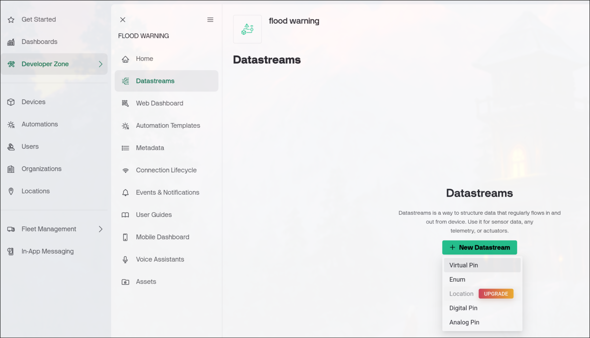


##### สร้าง Dashboard สำหรับแสดงผลข้อมูล

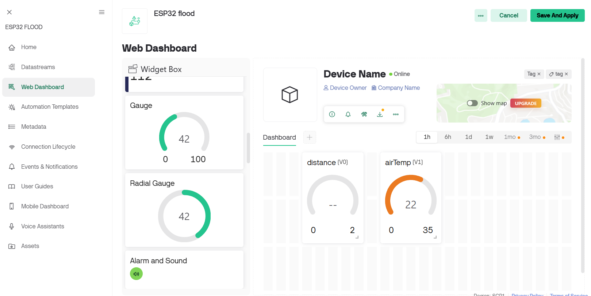

##### ตั้งค่า Device ไปที่ Home → New Device → คัดลอก Token มาใช้

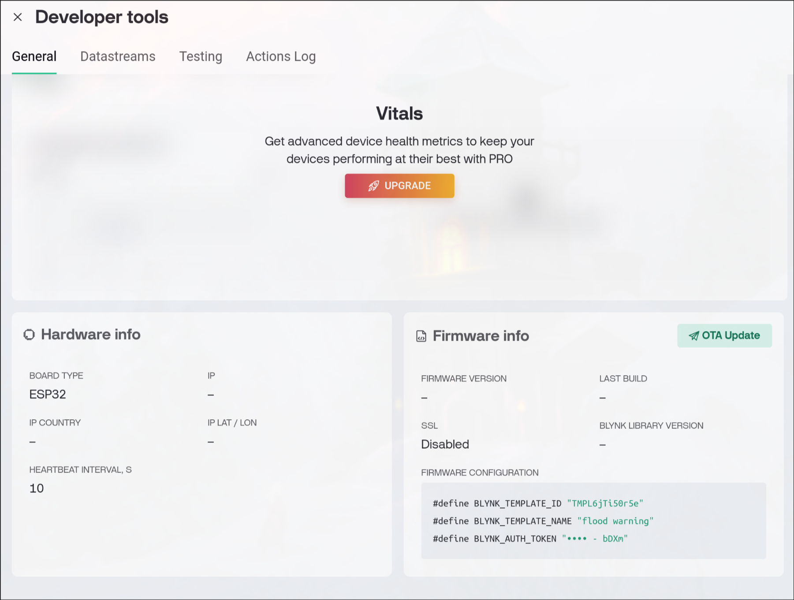

#### SETUP ESP32 

```cpp
#define BLYNK_PRINT Serial
#define BLYNK_TEMPLATE_ID "****"
#define BLYNK_TEMPLATE_NAME "*****"
#define BLYNK_AUTH_TOKEN  "***"

#include <WiFi.h>
#include <WiFiClient.h>
#include <BlynkSimpleEsp32.h>

// ====== ตั้งค่า WiFi ======
char ssid[] = "***";
char pass[] = "***";

// ====== ตัวแปรหลัก ======
BlynkTimer timer;

float distance = 0.0;
float airTemp  = 0.0;

// ====== ฟังก์ชันสุ่มค่า Sensor ======
void generateRandomData() {
  distance = random(50, 200) / 100.0;    // 0.5 – 2.0 m
  airTemp  = random(2000, 3500) / 100.0; // 20 – 35 °C

  Serial.printf("🔄 Random → Distance: %.2f m | Temp: %.2f °C\n", distance, airTemp);

  Blynk.virtualWrite(V0, distance);
  Blynk.virtualWrite(V1, airTemp);
}

void setup() {
  Serial.begin(115200);
  delay(1000);

  Blynk.begin(BLYNK_AUTH_TOKEN, ssid, pass);
  randomSeed(analogRead(0));
  timer.setInterval(10000L, generateRandomData);
}

void loop() {
  Blynk.run();
  timer.run();
}

```

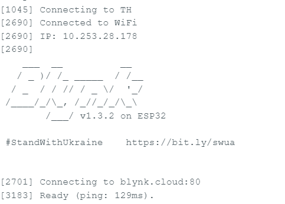

#### SETUP n8n (Workflow)

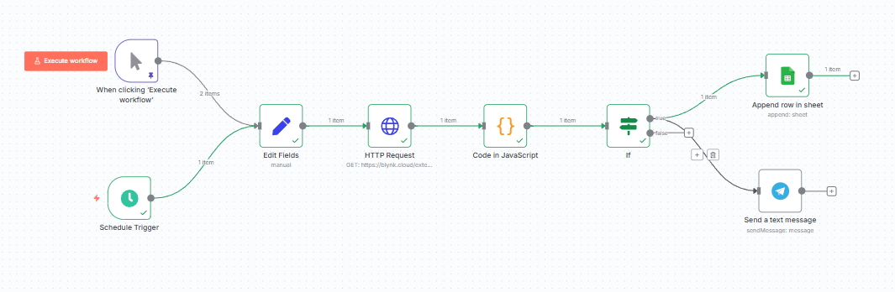

##### HTTP Blynk Api

***https://blynk.cloud/external/api/getAll?token={YOUR_TOKEN}***

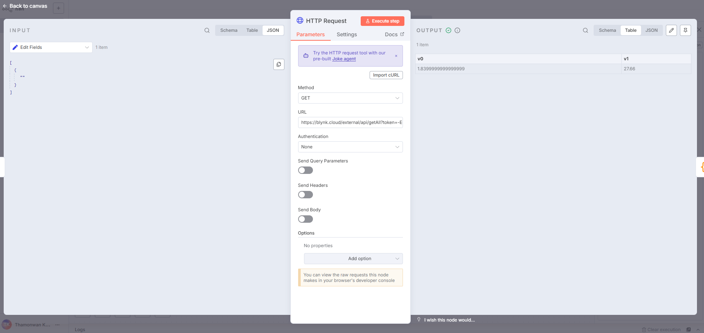

##### Function Code


```cpp
const distance = parseFloat($json.v0);
const temp = parseFloat($json.v1);

const isBelowThreshold = distance >= 1.0;

const now = new Date().getTime();
const last = $getWorkflowStaticData("global");
if (!last.lastLow) last.lastLow = 0;
if (!last.lastNormal) last.lastNormal = 0;

let action = '-';
if (isBelowThreshold || now - last.lastLow >= 60*1000) { // แจ้งทุก 1 นาที
    action = "LOW";
    last.lastLow = now;
    last.lastNormal = now;

} else if (last.wasLow) {
    action = "NORMAL"; // กลับสู่ปกติ
    last.wasLow = false;
    last.lastNormal = now;
  
}else if (now - last.lastNormal >= 60*60*1000) {
    action = "STABLE"; // ปกติคงที่ 60 นาที
    last.lastNormal = now;
}


return [{
  json: {
    distance,
    temp,
    action
  }
}];

```
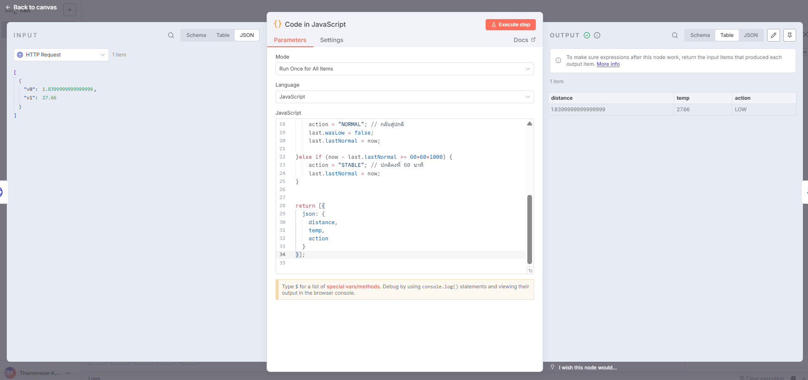

#### IF Node
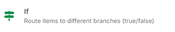

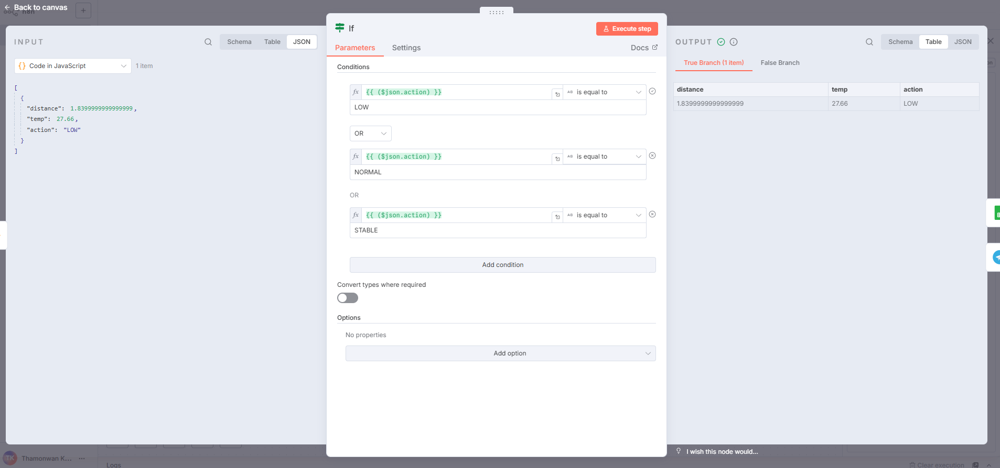

#### Google Sheet


##### สร้าง Api Google sheet

[Youtube n8n Google sheet](https://youtu.be/pKH2pflFV_s?si=bIV-yjtG7UD90NDM)

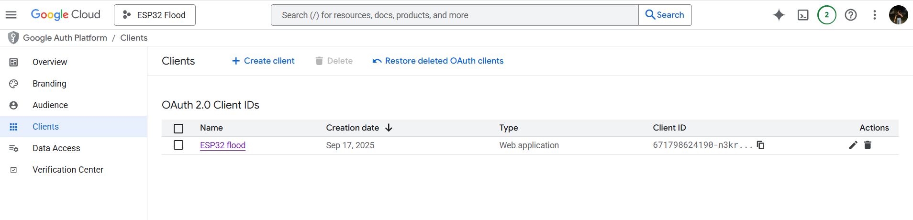

**Append Row to Google Sheet บันทึกข้อมูลลง Google Sheets**

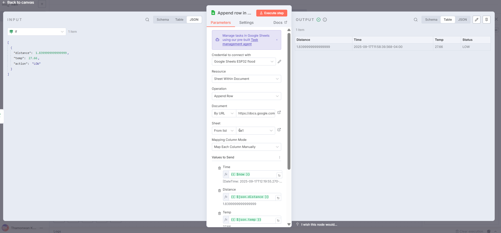

> * สร้างบอท
  -เปิด Telegram → ค้นหา @BotFather
  -พิมพ์
  /start
  /newbot
    -ตั้งชื่อบอทและ username (เช่น MyFloodBot)
>* หาค่า Chat ID
**https://api.telegram.org/bot<YOUR_BOT_TOKEN>/getUpdates**

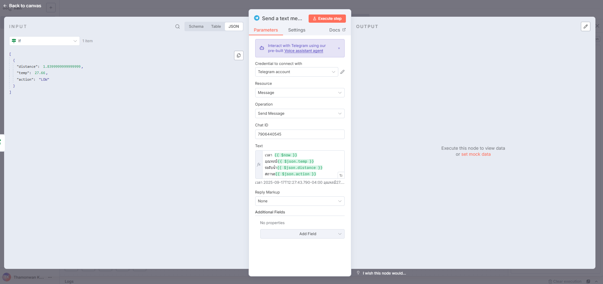

### ผลลัพธ์

**google sheet**


**telegram**

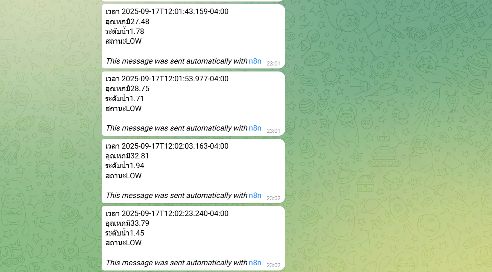