# **Siemens Simatic IPC127 – IoTs**

### **Software Install**

#### **NodeRED**
**[install NodeRed on IPC127](https://docs.aic-eec.com/biil/iot-connectivity-and-data-analytics-via-node-red/node-red-installation)**

>* Download และ ติดตั้ง Nodejs
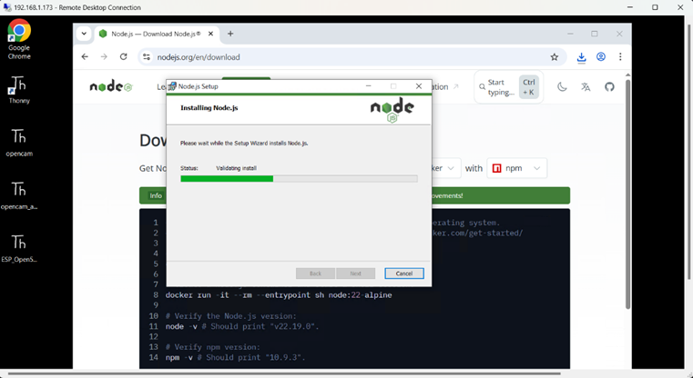

>* เมื่อติดตั้ง node-red ให้ปิด หน้าต่าง Commade Promp แล้วเปิดใหม่
>* พิมพ์ คำสั่ง เปิดใช้งาน node-red ดังนี้
$ node-red start 

###### **ผลลัพธ์**
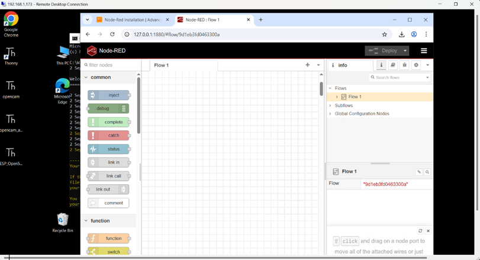

#### **Grafana** 
**[install Grafana on IPC127](https://grafana.com/grafana/download)**
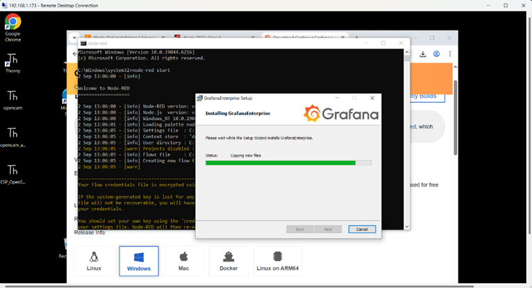


#### **InfluxDB**
**[install InfluxDB on IPC127](https://docs.influxdata.com/influxdb/v2/install/?t=Windows+Powershell)**
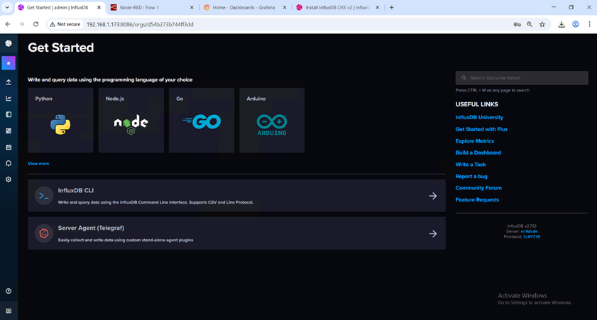


#### **MQTT Broker**
**[install MQTT Broker on IPC127](https://www.emqx.com/en/blog/install-mqtt-broker-on-windows)**
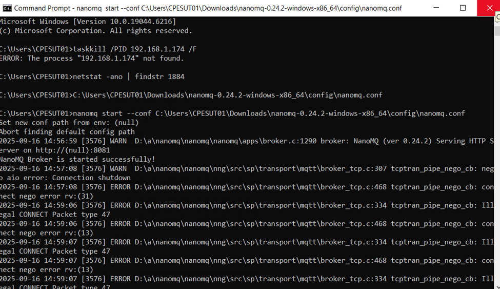

### **Data to Dashboard**
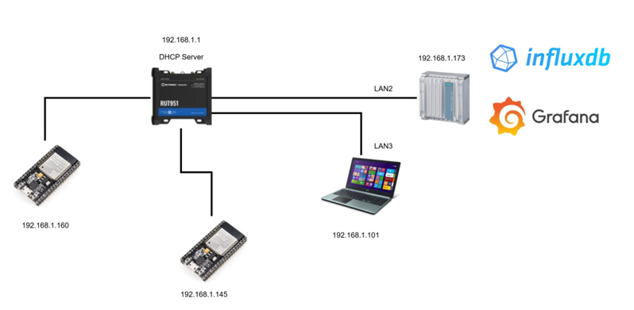
##### ใช้ ESP32 จำนวน สองตัว ส่งข้อมูลไปเก็บที่ InfluxDB บน IPC127

•	สถานี_1 ESP1 Data_11: อุณหภูมิ -> Random [0.00-49.99]
•	สถานี_1 ESP1 Data_12: ความชื้น -> Random [50.00-99.99]
•	สถานี_1 ESP1 Data_13: จำนวนที่ผลิต -> Step Up [0-999999]
•	สถานี_2 ESP2 Data_21: อุณหภูมิ -> Random [0.00-49.99]
•	สถานี_2 ESP2 Data_22: ความชื้น -> Random [50.00-99.99]
•	สถานี_2 ESP2 Data_23: จำนวนที่ผลิต -> Step Up [0-999999]

***ESP32 Code Text***
```cpp
  #include <WiFiMulti.h>
  WiFiMulti wifiMulti;
  #define DEVICE "ESP32"
#elif defined(ESP8266)
  #include <ESP8266WiFiMulti.h>
  ESP8266WiFiMulti wifiMulti;
  #define DEVICE "ESP8266"
#endif

#include <InfluxDbClient.h>
#include <InfluxDbCloud.h>

// WiFi config
#define WIFI_SSID "RUT956_E3C9"
#define WIFI_PASSWORD "12345678"

// InfluxDB config
#define INFLUXDB_URL "http://192.168.1.173:8086"   // IP ของ IPC127
#define INFLUXDB_TOKEN "gcQcSQNt7EjX85vjpjfjD6V0ZeBhdSa6mPrzfb4C0sXnKExoHv_lce_iyZC0ZX7tjzWYJWj5rhOVO0hg0g5Apg=="
#define INFLUXDB_ORG "d54b273b744ff3dd"
#define INFLUXDB_BUCKET "ESP32"

// Time zone
#define TZ_INFO "UTC7"

// InfluxDB client instance
InfluxDBClient client(INFLUXDB_URL, INFLUXDB_ORG, INFLUXDB_BUCKET, INFLUXDB_TOKEN, InfluxDbCloud2CACert);

// Data point (measurement = "station_data")
Point sensor("factory_2");

// ตัวแปรจำลองข้อมูล
long productionCounter = 0;

void setup() {
  Serial.begin(115200);

  // WiFi connect
  WiFi.mode(WIFI_STA);
  wifiMulti.addAP(WIFI_SSID, WIFI_PASSWORD);

  Serial.print("Connecting to WiFi");
  while (wifiMulti.run() != WL_CONNECTED) {
    Serial.print(".");
    delay(500);
  }
  Serial.println();
  Serial.println("WiFi connected!");
  Serial.print(" SSID: ");
  Serial.println(WiFi.SSID());
  Serial.print(" IP Address: ");
  Serial.println(WiFi.localIP());

  // Time sync
  timeSync(TZ_INFO, "pool.ntp.org", "time.nis.gov");

  // Check InfluxDB connection
  if (client.validateConnection()) {
    Serial.print("Connected to InfluxDB: ");
    Serial.println(client.getServerUrl());
  } else {
    Serial.print("InfluxDB connection failed: ");
    Serial.println(client.getLastErrorMessage());
  }

  // Add tags (metadata)
  // sensor.addTag("station", "1");
  // sensor.addTag("device", "ESP1");
}

void loop() {
  // ล้าง field เดิม (tag ยังอยู่)
  sensor.clearFields();

  // สร้างค่าจำลอง
  float temp = random(0, 5000) / 100.0;      // อุณหภูมิ [0.00 - 49.99]
  float hum = 50.0 + random(0, 5000) / 100.0; // ความชื้น [50.00 - 99.99]

  if (productionCounter > 999999) productionCounter = 0;
  productionCounter++;

  // ใส่ค่าลง field
  sensor.addField("temp_2", temp);
  sensor.addField("humid_2", hum);
  sensor.addField("จำนวนที่ผลิต_2", productionCounter);

  // Debug serial
  Serial.print("Writing: ");
  Serial.println(sensor.toLineProtocol());

  // Check WiFi
  if (wifiMulti.run() != WL_CONNECTED) {
    Serial.println(" Wifi connection lost");
  }

  // Write to InfluxDB
  if (!client.writePoint(sensor)) {
    Serial.print(" InfluxDB write failed: ");
    Serial.println(client.getLastErrorMessage());
  } else {
    Serial.println(" Data sent to InfluxDB");
  }

  delay(5000); // ส่งทุก 5 วินาที
}
```

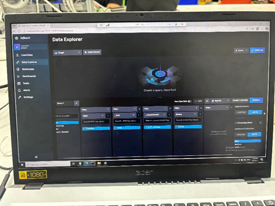

##### แสดงค่า Grafana Dashboard 
>* หน้า 1 แสดงค่า รายละเอียดของแต่ละสถานีผลิต
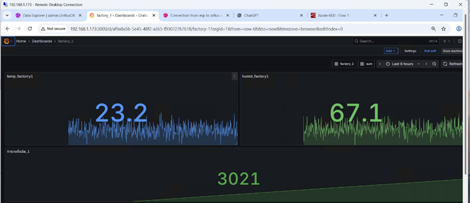

>* หน้า 2 แสดงค่า จำนวนที่ผลิตแต่ละสถานีและจำนวนรวมที่ผลิตได้
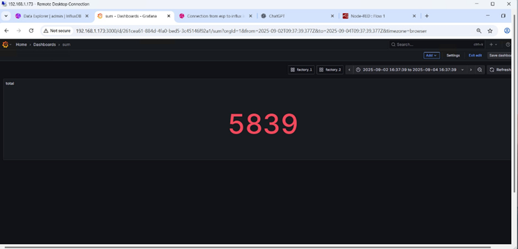

***code in infiuxDB***
```cpp
fac1 = from(bucket: "ESP32")
  |> range(start: -1h)
  |> filter(fn: (r) => r["_measurement"] == "factory_2")
  |> filter(fn: (r) => r["_field"] == "จำนวนที่ผลิต_2")
  |> aggregateWindow(every: 10s, fn: last, createEmpty: false)
  |> rename(columns: {_value: "value_fac2"})

fac2 = from(bucket: "ESP32")
  |> range(start: -1h)
  |> filter(fn: (r) => r["_measurement"] == "factory_1")
  |> filter(fn: (r) => r["_field"] == "จำนวนที่ผลิต_1")
  |> aggregateWindow(every: 10s, fn: last, createEmpty: false)
  |> rename(columns: {_value: "value_fac1"})

join(
  tables: {f1: fac1, f2: fac2},
  on: ["_time"]
)
|> map(fn: (r) => ({
  _time: r._time,
  _value: r.value_fac1 + r.value_fac2
}))
```
### **Alram if xxx**

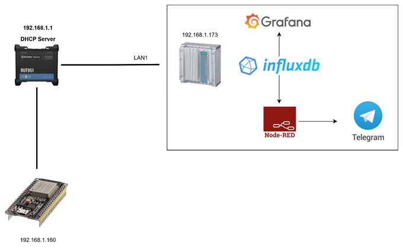

##### ใช้ NodeRED ร่วมกับ Telegram เพื่อสร้างการแจ้งเตือน

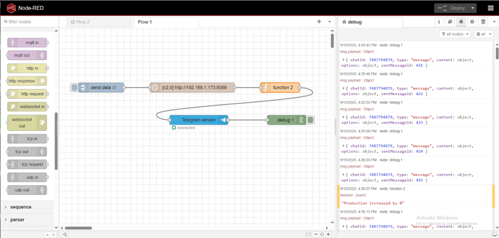

***fucntion in NodeRed***
```cpp
// รับข้อมูลที่ได้จาก InfluxDB node (Array ของ Object)
const data = msg.payload;

let telegramMessage = "";

// เงื่อนไขแจ้งเตือน
const tempThreshold = 35;      // อุณหภูมิสูงสุด
const humidityThreshold = 70;  // ความชื้นสูงสุด
const productionThreshold = 100; // การผลิตครบทุก 100 ชิ้น

// ตรวจสอบข้อมูล
if (!Array.isArray(data) || data.length === 0) {
    telegramMessage = "⚠️ ไม่พบข้อมูลจากสถานีในช่วงเวลาที่ระบุ";
} else {
    // สร้าง Object เก็บค่าล่าสุดของแต่ละ Field
    let latestValues = {};

    for (const point of data) {
        const fieldName = point._field;
        const deviceName = point.device;
        const value = point._value;

        if (fieldName && deviceName && value !== undefined) {
            const key = `${deviceName}_${fieldName}`;
            latestValues[key] = { value, device: deviceName, field: fieldName };
        }
    }

    // ตรวจสอบค่าที่เกิน threshold และจัดข้อความแจ้งเตือน
    telegramMessage = "⚠️ รายงานแจ้งเตือนจากสถานี:\n\n";
    let hasAlert = false;

    for (const key in latestValues) {
        const point = latestValues[key];
        let fieldLabel = "";
        let formattedValue;
        let alert = false;

        if (point.field.includes("temperature")) {
            fieldLabel = "อุณหภูมิ";
            formattedValue = point.value.toFixed(2);
            if (point.value > tempThreshold) alert = true;
        } else if (point.field.includes("humidity")) {
            fieldLabel = "ความชื้น";
            formattedValue = point.value.toFixed(2);
            if (point.value > humidityThreshold) alert = true;
        } else if (point.field.includes("production")) {
            fieldLabel = "การผลิต";
            formattedValue = point.value.toFixed(0);
            if (point.value % productionThreshold === 0 && point.value !== 0) alert = true;
        }

        // ถ้าเกิน threshold ให้เพิ่มข้อความแจ้งเตือน
        if (alert) {
            hasAlert = true;
            telegramMessage += `🏭 สถานี ${point.device}: ${fieldLabel} = ${formattedValue}`;
            telegramMessage += ` ⚠️ เกินค่าเงื่อนไข!\n`;
        }
    }

    if (!hasAlert) {
        telegramMessage = "✅ ไม่มีค่าที่เกินเงื่อนไขจากสถานีใด ๆ ในช่วงเวลานี้";
    }
}

// ตั้งค่า msg.payload ให้ Telegram Sender Node
msg.payload = {
    type: "message",
    chatId: "7806069251",      // แทนด้วย Chat ID จริง
    content: telegramMessage
};

return msg;
```

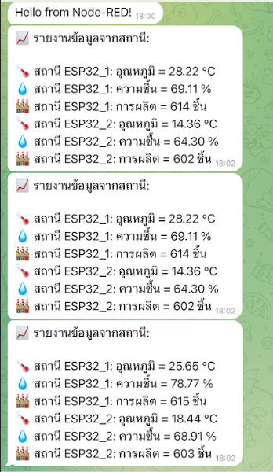

##### ปรับให้มี Alarm ไปยังผู้รับผิดชอบ อาจ fix ค่า หรือตั้งผ่าน Dashboard
**[Youtube by Grafana](https://youtu.be/ClLp-iSoaSY?si=KrpruipxUXfkKY0E)**

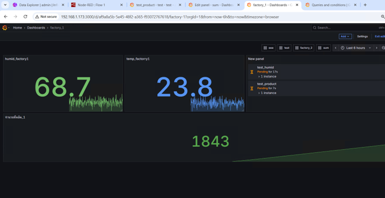
### **Control from Dashboard**

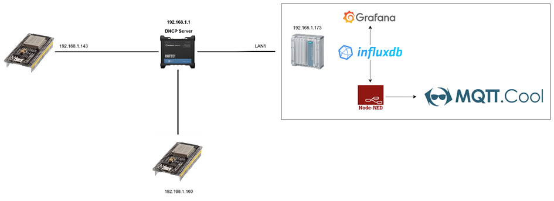

>* ต่อวงจรให้มี 3 LED {RED, YLW, GRN} ที่สถานีทั้ง สอง
##### จาก Grafana Dashboard ให้สามารถควบคุม LED ได้ ผ่าน MQTT Broker 

***[install MQTT Broker on IPC127 ](https://www.emqx.com/en/blog/install-mqtt-broker-on-windows)***

***[MQTT server Run on IPC127](https://mqtt-explorer.com/)***
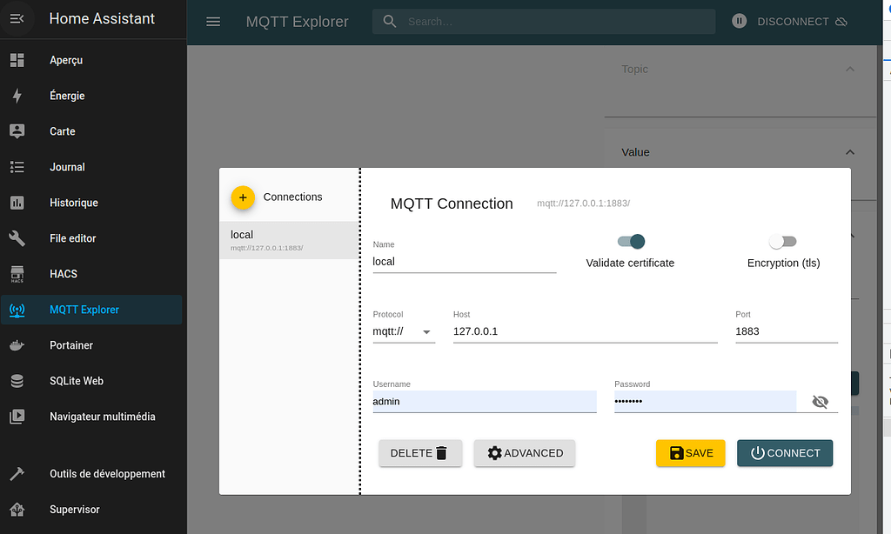

>* flow NodeRed


>* code Grafana
```cpp
<div style="font-size: 24px;display: flex;flex-wrap: wrap;justify-content: center;gap: 20px; ">
  <a href="http://192.168.1.174:1880/control/led/on21" style="background: white; color: #2c3e50; transform: translateY(-3px);padding:20px;border-radius:10px 10px 10px 10px">on</a>
  <a href="http://192.168.1.174:1880/control/led/off21"style="background: white; color: #2c3e50; transform: translateY(-3px);padding:20px;border-radius:10px 10px 10px 10px">off</a>
  <a href="http://192.168.1.174:1880/control/led/on22"style="background: red;   color: #fff;    transform: translateY(-3px);padding:20px;border-radius:10px 10px 10px 10px">on</a>
  <a href="http://192.168.1.174:1880/control/led/off22"style="background: red;   color: #fff;    transform: translateY(-3px);padding:20px;border-radius:10px 10px 10px 10px">off</a>
  <a href="http://192.168.1.174:1880/control/led/on23"style="background: green; color: #fff;    transform: translateY(-3px);padding:20px;border-radius:10px 10px 10px 10px">on</a>
  <a href="http://192.168.1.174:1880/control/led/off23"style="background: green; color: #fff;    transform: translateY(-3px);padding:20px;border-radius:10px 10px 10px 10px">off</a>
</div>

<div style="font-size: 24px;display: flex;flex-wrap: wrap;justify-content: center;gap: 20px; margin-top:10px" >
  <a href="http://192.168.1.174:1880/control/led/fac2/on21" style="background: blue; color: #fff; transform: translateY(-3px);padding:20px;border-radius:10px 10px 10px 10px">on</a>
  <a href="http://192.168.1.174:1880/control/led/fac2/off21"style="background: blue; color: #fff; transform: translateY(-3px);padding:20px;border-radius:10px 10px 10px 10px">off</a>
  <a href="http://192.168.1.174:1880/control/led/fac2/on22"style="background: red;   color: #fff;    transform: translateY(-3px);padding:20px;border-radius:10px 10px 10px 10px">on</a>
  <a href="http://192.168.1.174:1880/control/led/fac2/off22"style="background: red;   color: #fff;    transform: translateY(-3px);padding:20px;border-radius:10px 10px 10px 10px">off</a>
  <a href="http://192.168.1.174:1880/control/led/fac2/on23"style="background: green; color: #fff;    transform: translateY(-3px);padding:20px;border-radius:10px 10px 10px 10px">on</a>
  <a href="http://192.168.1.174:1880/control/led/fac2/off23"style="background: green; color: #fff;    transform: translateY(-3px);padding:20px;border-radius:10px 10px 10px 10px">off</a>
  </div>
```
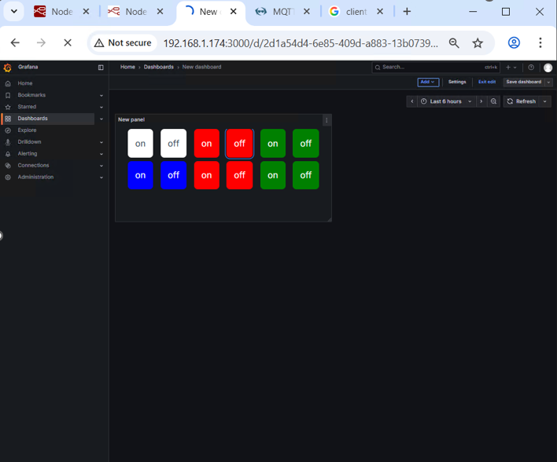

### ผลลัพธ์
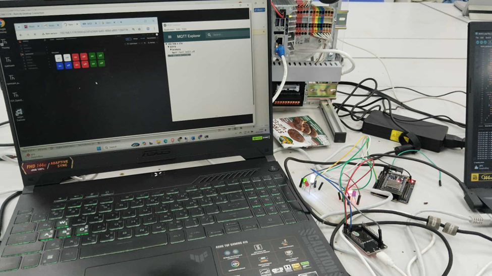

#####	หากเกิด Alarm ตาม Mission2 ให้ LED ทั้ง 3 ตัวกระพริบ
>* flow NodeRed

***ESP32 Code Text ตัวอย่างโค้ด***
```cpp
  #include <WiFiMulti.h> 
  WiFiMulti wifiMulti; 
  #define DEVICE "ESP32" 
#elif defined(ESP8266) 
  #include <ESP8266WiFiMulti.h> 
  ESP8266WiFiMulti wifiMulti; 
  #define DEVICE "ESP8266" 
#endif 
 
Page 21 of 25 
#include <InfluxDbClient.h> 
#include <InfluxDbCloud.h> 
#include <WiFi.h> 
#include <PubSubClient.h> 
// ===== WiFi Config ===== 
const char* ssid = "RUT956_E3C9";      
const char* password = "12345678"; 
// ===== InfluxDB Config ===== 
#define INFLUXDB_URL "http://192.168.1.173:8086"   // IP ของ IPC127 
#define INFLUXDB_TOKEN 
"gcQcSQNt7EjX85vjpjfjD6V0ZeBhdSa6mPrzfb4C0sXnKExoHv_lce_iyZC0ZX7tjzWYJWj5rhOVO0hg0g5Apg==
 " 
#define INFLUXDB_ORG "d54b273b744ff3dd" 
#define INFLUXDB_BUCKET "ESP32" 
// Time zone 
#define TZ_INFO "UTC7" 
// InfluxDB client instance 
InfluxDBClient client(INFLUXDB_URL, INFLUXDB_ORG, INFLUXDB_BUCKET, INFLUXDB_TOKEN, 
InfluxDbCloud2CACert); 
// Data point (measurement = "station_data") 
Point sensor("factory_2"); 
// ===== MQTT Config ===== 
const char* mqtt_server = "192.168.1.174";   
const int mqtt_port = 1884; 
WiFiClient espClient; 
PubSubClient mqttClient(espClient); 
// ===== LED Pin ===== 
const int ledPin21 = 21; 
const int ledPin22 = 22; 
const int ledPin23 = 23; 
Page 22 of 25 
// ===== Production counter ===== 
long productionCounter = 0; 
// ===== ฟังก์ชันเชื่อม WiFi ===== 
void setup_wifi() { 
WiFi.mode(WIFI_STA); 
wifiMulti.addAP(ssid, password); 
Serial.print("Connecting to WiFi"); 
while (wifiMulti.run() != WL_CONNECTED) { 
Serial.print("."); 
delay(500); 
} 
Serial.println("\nWiFi connected!"); 
Serial.print("SSID: "); 
Serial.println(WiFi.SSID()); 
Serial.print("IP Address: "); 
Serial.println(WiFi.localIP()); 
} 
// ===== MQTT Callback ===== 
void callback(char* topic, byte* payload, unsigned int length) { 
String message; 
for (int i = 0; i < length; i++) { 
message += (char)payload[i]; 
} 
Serial.print("Message arrived ["); 
Serial.print(topic); 
Serial.print("] "); 
Serial.println(message); 
if (message == "fac2_led21_on") { 
digitalWrite(ledPin21, HIGH); 
Serial.println("LED 21 ON"); 
} else if (message == "fac2_led21_off") { 
digitalWrite(ledPin21, LOW); 
Serial.println("LED 21 OFF"); 
} else if (message == "fac2_led22_on") { 
Page 23 of 25 
digitalWrite(ledPin22, HIGH); 
Serial.println("LED 22 ON"); 
} else if (message == "fac2_led22_off") { 
digitalWrite(ledPin22, LOW); 
Serial.println("LED 22 OFF"); 
} else if (message == "fac2_led23_on") { 
digitalWrite(ledPin23, HIGH); 
Serial.println("LED 23 ON"); 
} else if (message == "fac2_led23_off") { 
digitalWrite(ledPin23, LOW); 
Serial.println("LED 23 OFF"); 
} 
} 
// ===== MQTT Reconnect ===== 
void reconnect() { 
while (!mqttClient.connected()) { 
Serial.print("Attempting MQTT connection..."); 
if (mqttClient.connect("Esp_fact2")) { 
Serial.println("connected"); 
mqttClient.subscribe("fac2");   // subscribe topic เดียว 
} else { 
Serial.print("failed, rc="); 
Serial.print(mqttClient.state()); 
Serial.println(" try again in 5 seconds"); 
delay(5000); 
} 
} 
} 
// ===== Setup ===== 
void setup() { 
Serial.begin(115200); 
// ตั้งค่า LED 
pinMode(ledPin21, OUTPUT); 
pinMode(ledPin22, OUTPUT); 
pinMode(ledPin23, OUTPUT); 
digitalWrite(ledPin21, LOW); 
Page 24 of 25 
digitalWrite(ledPin22, LOW); 
digitalWrite(ledPin23, LOW); 
// WiFi 
setup_wifi(); 
// Time sync 
timeSync(TZ_INFO, "pool.ntp.org", "time.nis.gov"); 
// InfluxDB connection check 
if (client.validateConnection()) { 
Serial.print("Connected to InfluxDB: "); 
Serial.println(client.getServerUrl()); 
} else { 
Serial.print("InfluxDB connection failed: "); 
Serial.println(client.getLastErrorMessage()); 
} 
// MQTT 
mqttClient.setServer(mqtt_server, mqtt_port); 
mqttClient.setCallback(callback); 
} 
// ===== Loop ===== 
void loop() { 
// MQTT maintain 
if (!mqttClient.connected()) { 
reconnect(); 
} 
mqttClient.loop(); 
// === InfluxDB === 
sensor.clearFields(); 
float temp = random(0, 5000) / 100.0;       
float hum = 50.0 + random(0, 5000) / 100.0;  
if (productionCounter > 999999) productionCounter = 0; 
productionCounter++; 
Page 25 of 25 
if (temp > 40 || hum > 80) { 
Serial.println("Warning: Temp > 35 and Humidity > 70 -> Blink LED 23"); 
for (int i = 0; i < 3; i++) {   // กระพริบ 3 ครั้ง 
digitalWrite(ledPin23, HIGH); 
digitalWrite(ledPin22, HIGH); 
digitalWrite(ledPin21, HIGH); 
delay(200); 
digitalWrite(ledPin23, LOW); 
digitalWrite(ledPin22, LOW); 
digitalWrite(ledPin21, LOW); 
delay(200); 
} 
} 
sensor.addField("temp_2", temp); 
sensor.addField("humid_2", hum); 
sensor.addField("จำนวนที่ผลิต_2", productionCounter); 
Serial.print("Writing: "); 
Serial.println(sensor.toLineProtocol()); 
if (wifiMulti.run() != WL_CONNECTED) { 
Serial.println(" Wifi connection lost"); 
} 
if (!client.writePoint(sensor)) { 
Serial.print(" InfluxDB write failed: "); 
Serial.println(client.getLastErrorMessage()); 
} else { 
Serial.println(" Data sent to InfluxDB"); 
} 
delay(100); // ส่งทุก 5 วินาที 
} 
```

### ผลลัพธ์

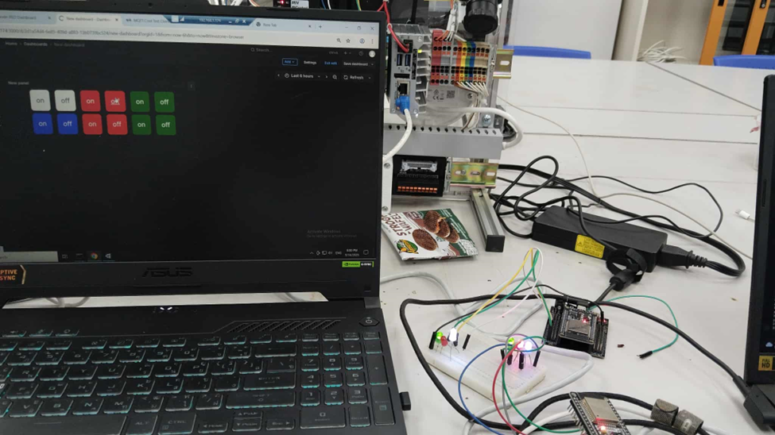
