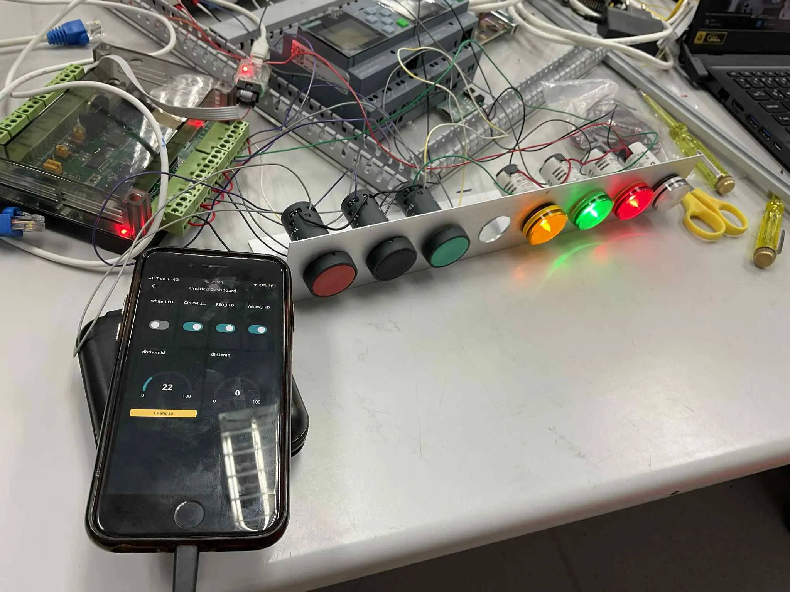

# **ET-ESP32-RS485 V2 Board + Arduino  Cloud Plaform**


# Mission 

[1. 4-Lamp](#4-lamp)   
[2. Green Lamp + Green Switch, Black Lamp + Yellow Switch, RED Lamp + RED Switch](#green-lamp--green-switch--black-lamp--yellow-switch--red-lamp--red-switch)  
[3. Smart Phone + White Lamp](#smart-phone--white-lamp)  
[4. Smart Phone + Rly1, Rly2](#smart-phone--rly1-rly2)  
[5. Smart Phone + Green Lamp + Green Switch](#smart-phone--green-lamp--green-switch)  
[6. Smart Phone + Black Lamp + Yellow Switch](#smart-phone--black-lamp--yellow-switch)  
[7. Smart Phone + RED Lamp + RED Switch](#smart-phone--red-lamp--red-switch)
#


## **4-Lamp**


```cpp
#include "Arduino.h"
#include "PCF8574.h" // https://github.com/xreef/PCF8574_library
#define I2C_Address 0x20
#define I2C_SDA_Pin 21
#define I2C_SCL_Pin 22

// Instantiate Wire for generic use at 100kHz
TwoWire I2Ctwo = TwoWire(1);
// Set i2c address
PCF8574 pcf8574(&I2Ctwo, I2C_Address, I2C_SDA_Pin, I2C_SCL_Pin);

void setup() {
    Serial.begin(115200);
    pcf8574.pinMode(0, OUTPUT);
    pcf8574.pinMode(1, OUTPUT);
    pcf8574.pinMode(2, OUTPUT);
    pcf8574.pinMode(3, OUTPUT);
    pcf8574.pinMode(4, INPUT_PULLUP);
    pcf8574.pinMode(5, INPUT_PULLUP);
    pcf8574.pinMode(6, INPUT_PULLUP);
    pcf8574.pinMode(7, INPUT_PULLUP);
    pcf8574.begin();
}

int pin = 0;
void loop() {
    Serial.println(pin);
    pcf8574.digitalWrite(pin, LOW); delay(500);
    pcf8574.digitalWrite(pin, HIGH); delay(500);
    pin = pin >= 3 ? 0 : pin += 1;
}
```


**ผลลัพธ์ที่ได้**


## **Green Lamp + Green Switch , Black Lamp + Yellow Switch , RED Lamp + RED Switch**


```cpp
#include "Arduino.h"
#include "PCF8574.h"  // https://github.com/xreef/PCF8574_library
#define I2C_Address 0x20
#define I2C_SDA_Pin 21
#define I2C_SCL_Pin 22
// Instantiate Wire for generic use at 100kHz
TwoWire I2Ctwo = TwoWire(1);
// Set i2c address
PCF8574 pcf8574(&I2Ctwo, I2C_Address, I2C_SDA_Pin, I2C_SCL_Pin);
void setup() {
  Serial.begin(115200);
  pcf8574.pinMode(0, OUTPUT);//yellow
  pcf8574.pinMode(1, OUTPUT);//green
  pcf8574.pinMode(2, OUTPUT);//red
  pcf8574.pinMode(3, OUTPUT);//white  
  pcf8574.pinMode(4, INPUT_PULLUP);
  pcf8574.pinMode(5, INPUT_PULLUP);
  pcf8574.pinMode(6, INPUT_PULLUP);
  pcf8574.pinMode(7, INPUT_PULLUP);
  pcf8574.begin();
}
int Counter1 = 0;
int Counter2 = 0;
int Counter3 = 0;
void loop() {
  //
  if (pcf8574.digitalRead(P4) == LOW) {
    delay(100);
    while (pcf8574.digitalRead(P4) == LOW)
      delay(50);
    Counter1++;
    delay(100);
    Serial.println(Counter1);
    pcf8574.digitalWrite(P1, Counter1 % 2);
  }

  if (pcf8574.digitalRead(P5) == LOW) {
    delay(100);
    Counter2++;
    while (pcf8574.digitalRead(P5) == LOW) {
      delay(200);
      // if (Counter2 % 2 == 0) {
      //   Counter2 += 1;
    }
    pcf8574.digitalWrite(P2, Counter2 % 2);
    delay(100);
    Serial.println(Counter2);
  }
  if (pcf8574.digitalRead(P6) == HIGH) {
    delay(50);
    if (pcf8574.digitalRead(P6) == HIGH) {
            Counter3++;
            delay(100);
            Serial.printf("red = %d , %d \n", Counter3, pcf8574.digitalRead(P6));
            pcf8574.digitalWrite(P0, Counter3 % 2);
    }
    Serial.println(pcf8574.digitalRead(P0));
  }    
}
```

### Arduino Cloud Platform



```cpp
#include "arduino_secrets.h"
#include <HS3UKA_PCF8574.h>


#include "thingProperties.h"

#include "Arduino.h"
#include "PCF8574.h"
#define I2C_Address 0x20
#define I2C_SDA_Pin 21
#define I2C_SCL_Pin 22
// Instantiate Wire for generic use at 100kHz
TwoWire I2Ctwo = TwoWire(1);
// Set i2c address
PCF8574 pcf8574(&I2Ctwo, I2C_Address, I2C_SDA_Pin, I2C_SCL_Pin);

void setup() {
  Serial.begin(9600);
  pcf8574.pinMode(0, OUTPUT);
  pcf8574.pinMode(1, OUTPUT);
  pcf8574.pinMode(2, OUTPUT);
  pcf8574.pinMode(3, OUTPUT);
  pcf8574.pinMode(4, INPUT_PULLUP);
  pcf8574.pinMode(5, INPUT_PULLUP);
  pcf8574.pinMode(6, INPUT_PULLUP);
  pcf8574.pinMode(7, INPUT_PULLUP);
  pcf8574.begin();
  // This delay gives the chance to wait for a Serial Monitor without blocking if none is found
  delay(1500);

  // Defined in thingProperties.h
  initProperties();

  // Connect to Arduino IoT Cloud
  ArduinoCloud.begin(ArduinoIoTPreferredConnection);

  /*
     The following function allows you to obtain more information
     related to the state of network and IoT Cloud connection and errors
     the higher number the more granular information you’ll get.
     The default is 0 (only errors).
     Maximum is 4
 */
  setDebugMessageLevel(2);
  ArduinoCloud.printDebugInfo();
}

int Counter1 = 0; //green
int Counter2 = 0; //yellow
int Counter3 = 0; //red

void loop() {
  ArduinoCloud.update();
//--------------------------------------------------------green-------------------------------------------
  delay(10);
  if (pcf8574.digitalRead(P4) == LOW) {
    delay(100);
    while (pcf8574.digitalRead(P4) == LOW)
      delay(50);
    Counter1++;
    delay(100);

    if (Counter1 % 2 == 0) {
      GREEN_LED = 0;
    } else {
      GREEN_LED = 1;
    }
    Serial.println(Counter1);
  }
  //--------------------------------------------------------yellow-------------------------------------------
  delay(10); 
  if (pcf8574.digitalRead(P5) == LOW) {
    delay(100);

    while (pcf8574.digitalRead(P5) == LOW)
      delay(50);
    Counter2++;
    delay(100);
    if (Counter2 % 2 == 0) {
      YELLOW_LED = 1;
    } else {
      YELLOW_LED = 0;
    }
    Serial.println(Counter2);
  }
   //--------------------------------------------------------red-------------------------------------------
  delay(10);
  if (pcf8574.digitalRead(P6) == HIGH) {
    delay(50);
    if (pcf8574.digitalRead(P6) == HIGH) {
      Counter3++;
      delay(100);
      Serial.printf("red = %d , %d \n", Counter3, pcf8574.digitalRead(P6));
    }
    if (Counter3 % 2 == 0) {//update  status in dasbord
      RED_LED = 1;
    } else {
      RED_LED = 0;
    }
    Serial.println(pcf8574.digitalRead(P6));
  }

  pcf8574.digitalWrite(P0, Counter2 % 2);
  pcf8574.digitalWrite(P1, Counter1 % 2);
  pcf8574.digitalWrite(P2, Counter3 % 2);
  
}


void onLEDWhiteChange() {
  if (LED_white == 1) {
    Serial.println("W_ON");
    pcf8574.digitalWrite(P3, LOW);

  } else {
    Serial.println("W_OFF");
    pcf8574.digitalWrite(P3, HIGH);
  }
}
/*
  Since GREENLED is READ_WRITE variable, onGREENLEDChange() is
  executed every time a new value is received from IoT Cloud.
*/
void onGREENLEDChange() {
  // Add your code here to act upon GREENLED change
  if (GREEN_LED == 1) {
    Serial.println("GR_ON");
    // pcf8574.digitalWrite(P1,LOW);
    Counter1++;

  } else {
    Serial.println("GR_OFF");
    // pcf8574.digitalWrite(P1,HIGH);
    Counter1++;
  }
}
/*
  Since YELLOWLED is READ_WRITE variable, onYELLOWLEDChange() is
  executed every time a new value is received from IoT Cloud.
*/
void onYELLOWLEDChange() {
  // Add your code here to act upon YELLOWLED change
  if (YELLOW_LED == 1) {
    Serial.println("GR_ON");
    // pcf8574.digitalWrite(P1,LOW);
    Counter2++;

  } else {
    Serial.println("GR_OFF");
    // pcf8574.digitalWrite(P1,HIGH);
    Counter2++;
  }
}

void onREDLEDChange()  {
  // Add your code here to act upon REDLED change
  if(RED_LED == 1 ){
    Serial.println("GR_ON");
    // pcf8574.digitalWrite(P1,LOW);
    Counter3++;
    
  }else{
    Serial.println("GR_OFF");
    // pcf8574.digitalWrite(P1,HIGH);
    Counter3++;
  }
}
```