# **PLC - Siemens LOGO!**

# Mission 

[1.	LOGO8_t01_InputOutput](#LOGO8_t01_InputOutput)   
[2.LOGO8_t02a_pressOnpressOff_Ladder = Toggle with Ladder ](#LOGO8_t02a_pressOnpressOff_Ladder=Toggle_with_Ladder)  
[3. LOGO8_t02b_pressOnpressOff = Toggle with FBD](#LOGO8_t02b_pressOnpressOff=Toggle_with_FBD)  
[4. LOGO8_t03_pressOn_HoldOff ](#LOGO8_t03_pressOn_HoldOff)  
[5.  LOGO8_t04_Using_Cursor ](#LOGO8_t04_Using_Cursor)  
[6.  LOGO8_t05a_Count_Show](#LOGO8_t05a_Count_Show)  
[7. LOGO8_t05b_Count_SpeedUp](#LOGO8_t05b_Count_SpeedUp)
[8. LOGO8_t10_Modbus_TCP ](#LOGO8_t10_Modbus_TCP)
[9. LOGO8_t10_Samkoon_LOGO8 ](#LOGO8_t10_Samkoon_LOGO8)
[10. LOGO8_t90_Traffic_Light ](#LOGO8_t90_Traffic_Light)

## **LOGO8_t01_InputOutput**

>3.1 Add Device: Network View → Add New Device >> Select = LOGO! 8_3_1, IP, SN, GW  
3.2 Edit FBD and save to “LOGO8_t01_InputOutput”   
3.3 Load: Tools → Transfer → PC to LOGO8, Fill LOGO! IP, Ok   
3.4 RUN: Change to Run Mode  

> **ผลลัพธ์ที่ได้** :sunflower:

## **LOGO8_t02a_pressOnpressOff_Ladder=Toggle_with_Ladder**
>Contacts → Make Contact   
>Special Function → Micelenos → And Edge    
>Contacts → Relay Coil   
>Contacts → Break Contact   

> RUN

> **ผลลัพธ์ที่ได้** :sunflower:

## **LOGO8_t02b_pressOnpressOff=Toggle_with_FBD**
>.Input, AND (Edge), Flag, XOR, Output  
.Input, NOT, AND (Edge), Flag, XOR, Output 

> **ผลลัพธ์ที่ได้** :sunflower:

## **LOGO8_t03_pressOn_HoldOff**

>6.1 Edit FBD for I1 and I2  
6.2 Edit FBD for “Hold(2Sec)On_Hold(4Sec)Off” 

> **ผลลัพธ์ที่ได้** :sunflower:

## **LOGO8_t04_Using_Cursor**
>7.1 Press (ESC + Cursor Key) for Input   
7.2 Double Click B002 for Text Edit and display All Member Name on Screen   
7.3 Edit FBD for “Up/Dw = On/Off Q0” and “LF/RG = On/Off Q1”  

> **ผลลัพธ์ที่ได้** :sunflower:  
>ESC + Cursor = การนำทางเมนู

## **LOGO8_t05a_Count_Show**
>8.1 More Data  [Youtube](https://www.youtube.com/watch?v=aOQxynpRd1o)  :book:  
8.2 Counter increase/decrease and show 

> **ผลลัพธ์ที่ได้** :sunflower: 
>

## **LOGO8_t05b_Count_SpeedUp**
>9.1 More Data [Youtube](https://www.youtube.com/watch?v=aOQxynpRd1o) :book:    
9.2 Counter increase/decrease with speed up and show 

> **ผลลัพธ์ที่ได้** :sunflower: 

## **LOGO8_t10_Modbus_TCP**
* 10.1 LOGOSoft Code  
   * Right Click → Add Server Connection → Modbus Communication   
  * Modbus TCP at IP and Port = 502  

* 10.2 Test with ModbusPool 
  * 10.2.1 Install Modbus Poll 64 Bit V 9.5.0 
  * 10.2.2 Remote from “Modbus Poll”   
    * Connection → Connect → Modbus TCP/IP   
    * Modbus TCP == IP:502 
  

 * * 10.2.3 Setup → Read/Write Definition

 * * 10.2.4  Display in Binara Word 

> **ผลลัพธ์ที่ได้** :sunflower: 

## **LOGO8_t10_Samkoon_LOGO8**
* 10.5Test with Samkoon HMI
  * 10.5.1 Install Samkoon Software “SKTOOLV7.0.0.35_setup(20191220)”
  * 10.5.2 Open SKTOOL7.0 → New Project → Model=SK-070HS

* * Create Link-1
* * Create Screen

* Communication Port
  *  General Tab

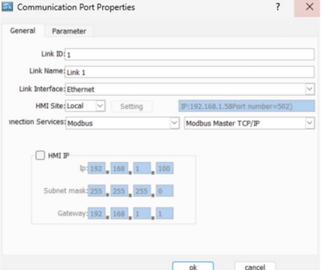

* * Parameter Tab
* * PLC IP:502

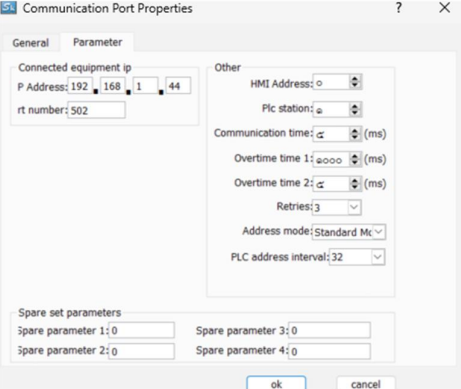

* Modbus Poll
  * Function 03 Read Holding(4x)

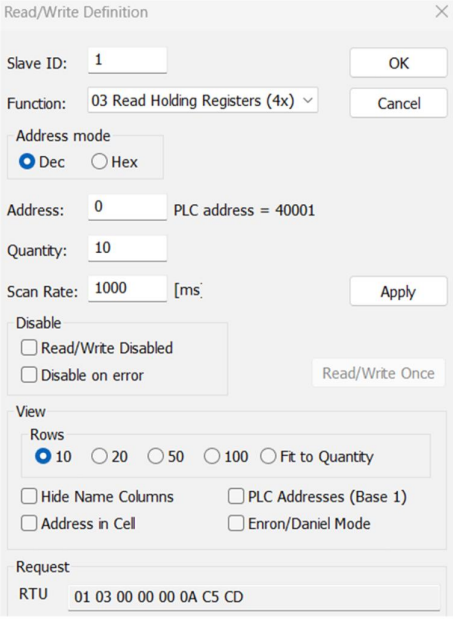

* Samkooon
  * Click Numeric Display
  
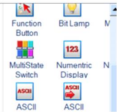

* * Edit
* * Data Type = 16 Unsigned
* * Display Type = 16 Binary
* * Monitor Address = Link1, 4x0

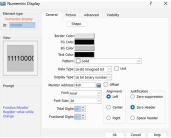

* * And Copy
* * Change Monitor Address for Link1 4x0, Link1 4X1

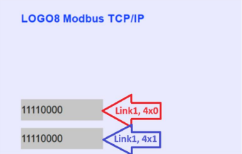

* Download → Online
* Simulation
  * Link1 Tab → Run

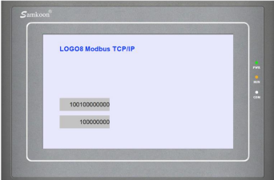

* Click Bit Lamp

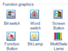

  * * Edit
      * Shape = 21
      * State 1 = Red, Black, Red
      * State 0 = Green, Black, Green
      * Data Type = Word Bit
      * Monitor Address = Link1, 4x0
      * Bit Number = 8

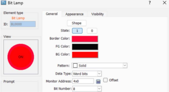

* * Place Bit Lamp
* *  And Copy
* *  Change Monitor 
Address for Link1 
4x0, Link1 4x1, Link1 
4x2, Link1 4x3

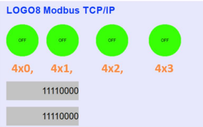

* Download → Online
* Simulation
  * Link1 Tab → Run

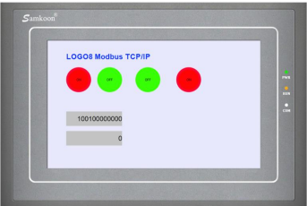

Modbus Poll
• Write Single Register
• ID = 1
• Function = 6
• Address = 0x003
• Value = 0x0100

## **LOGO8_t90_Traffic_Light**