# **Schinder.PLC M221**

# Basic Ladder Programing in PLC 

## Basic I/O 
> Start New Project 
 Switch to RUN Mode 
ต่อวงจร กำหนด PC IP และ M221 IP 

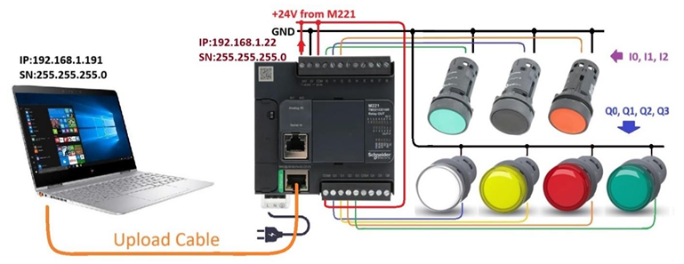

* ตัวแปร %I คือ ตัวแปรที่รับค่ามาจาก port input จาก ตัว PLC 
* ตัวแปะ %Q คือ ตัวแปรที่ส่งค่าไปออกที่ port output ที่ตัว PLC 
* ตัวแปร %M คือ ตัวแปร memory ภายใน เพื่อส่งค่าไปให้ ตัวแปรภายใน

> Model >> TM221CE16R 

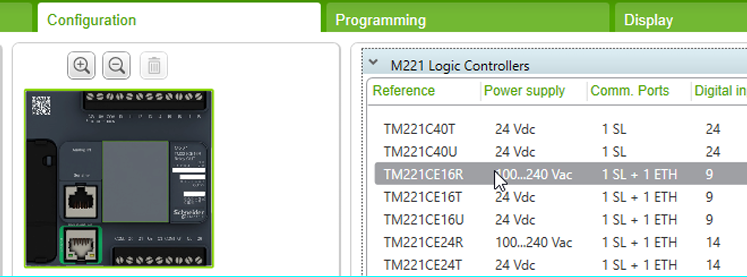
>เลือก board แล้ว login

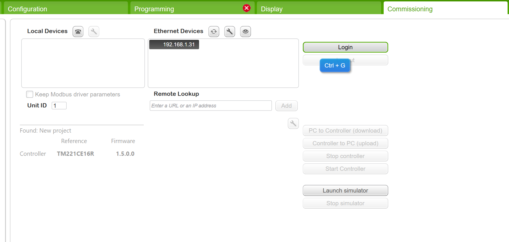

## Output Same Input 

> เงื่อนไขการทดลอง 
  ทำวงจรที่สามารถทำงานได้ตามรายละเอียดต่อไปนี้
>1. กด SW1  LAMP1 แสดงการทำงาน 
>2. กด SW2  LAMP2 แสดงการทำงาน 
>3. กด SW3  LAMP3 แสดงการทำงาน 

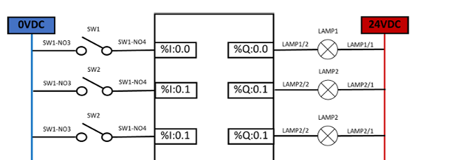

> **วงจรที่ได้** :rotating_light:

> **ผลลัพธ์ที่ได้** :sunflower:

## Invert Output 

> เงื่อนไขการทดลอง 
ทำวงจรที่สามารถทำงานได้ตามรายละเอียดต่อไปนี้
>1. กด SW1  LAMP1 หยุดทำงาน 
>2. กด SW2  LAMP2 หยุดทำงาน 
>3. กด SW3  LAMP3 หยุดทำงาน 

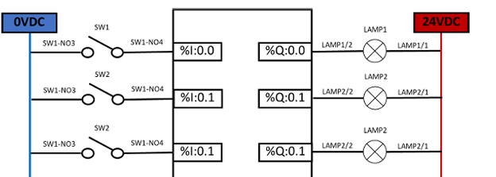

> **วงจรที่ได้** :rotating_light:

> **ผลลัพธ์ที่ได้** :sunflower:

## Self-Holding 
>เงื่อนไขการทดลอง 
>1. กด SW1  LAMP1 แสดงการทำงานค้างตลอดเวลา 
>2. กด SW2  LAMP1 หยุดทำงาน 

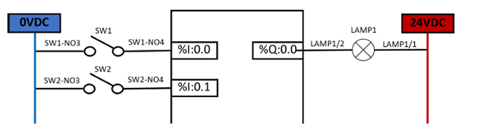

> **วงจรที่ได้** :rotating_light:

> **ผลลัพธ์ที่ได้** :sunflower:

## Set/Reset 

>เงื่อนไขการทดลอง 
>1. กด SW1  LAMP1 แสดงการทำงานค้างตลอดเวลา 
>2. กด SW2  LAMP1 หยุดทำงาน

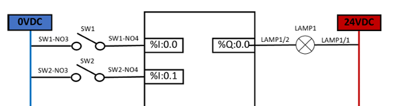

> **วงจรที่ได้** :rotating_light:

> **ผลลัพธ์ที่ได้** :sunflower:

 

## Inter Lock Output 
>เงื่อนไขการทดลอง 
>1.  กด SW1 ค้างไว้ LAMP1 จะแสดงการทำงาน, แต่ในขณะที่กด SW2 ต่อจาก SW1, LAMP2 จะแสดงการทำงานแทน LAMP 1 
>2.  กด SW2 ค้างไว้ LAMP2 จะแสดงการทำงาน, แต่ในขณะที่กด SW1 ต่อจาก SW2, LAMP1 จะแสดงการทำงานแทน LAMP 2 

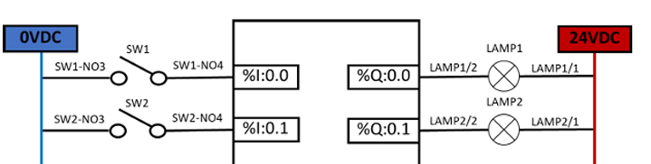

> **วงจรที่ได้** :rotating_light:

> **ผลลัพธ์ที่ได้** :sunflower:
 

## Inter Lock Input 

>เงื่อนไขการทดลอง 
>1. กด SW1 LAMP1 แสดงการทำงาน, กด SW1 ค้าง จะไม่สามารถกด SW2 เพื่อแสดงการทำงานของ LAMP2 ได้ 
>2. กด SW2 LAMP2 แสดงการทำงาน, กด SW2 ค้าง จะไม่สามารถกด SW1 เพื่อแสดงการทำงานของ LAMP1 ได้ 

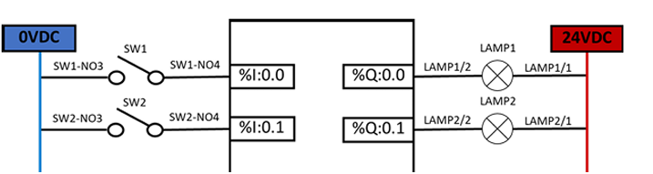

> **วงจรที่ได้** :rotating_light:

> **ผลลัพธ์ที่ได้** :sunflower:
 

## Pulse Input 
>เงื่อนไขการทดลอง 
>1. กด SW1 LAMP2 จะกะพริบ, ปล่อย SW1 LAMP1 จะกะพริบ

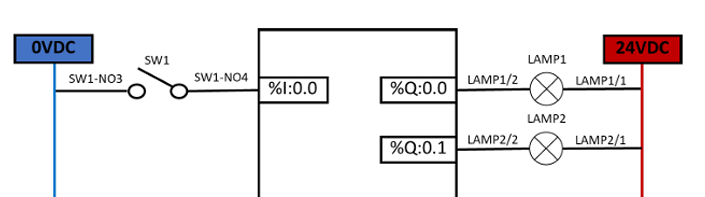

> **วงจรที่ได้** :rotating_light:

> **ผลลัพธ์ที่ได้** :sunflower:
 

## Internal Relay 
>เงื่อนไขการทดลอง 
>1. ในขณะที่ไม่มีการกดสวิตช์ LAMP2 จะแสดงการทำงาน, แต่เมื่อกด SW1 LAMP2 จะหยุดการทำงาน แต่ LAMP1 จะทำงานแทน 

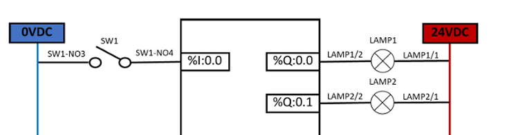

> **วงจรที่ได้** :rotating_light:

> **ผลลัพธ์ที่ได้** :sunflower:

## Timer 
>เงื่อนไขการทดลอง 
>1. กด SW1  LAMP1 จะแสดงการทำงาน 3 วินาที หลังจากทำงานครบ 3 วินาที LAMP1 จะดับ 

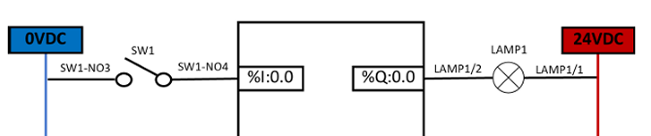

> **วงจรที่ได้** :rotating_light:

> **ผลลัพธ์ที่ได้** :sunflower:

 

## Lamp Rotation

>เงื่อนไขการทดลอง
>1. กด SW1 LAMP1 แสดงการทำงาน 3 วินาที หลังจากทำงานครบ 3 วินาที LAMP1 จะดับ และ LAMP2 จะแสดงการทำงาน 3 วินาที  หลังจากทำงานครบ 3 วินาที LAMP2 จะดับ และ LAMP3 จะแสดงการทำงาน 3 วินาที หลังจากทำงานครบ 3 วินาที LAMP3 จะดับทำงานแบบนี้วนซ้ำไปเรื่อย ๆ 
>2. กด SW2 จะหยุดการทำงานของ LAMP ทั้ง 3 หลอด 

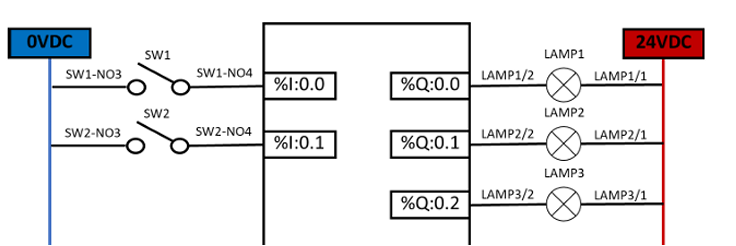

> **วงจรที่ได้** :rotating_light:

> **ผลลัพธ์ที่ได้** :sunflower:
> 
>  

## Flash LED (LED Flicker) 

>เงื่อนไขการทดลอง 
>1. กด SW1 LAMP1 แสดงการทำงาน 1 วินาที หยุดทำงาน 1 วินาที และเริ่มทำงานใหม่แบบต่อเนื่อง 
>2. กด SW2 LAMP1 หยุดการทำงาน 

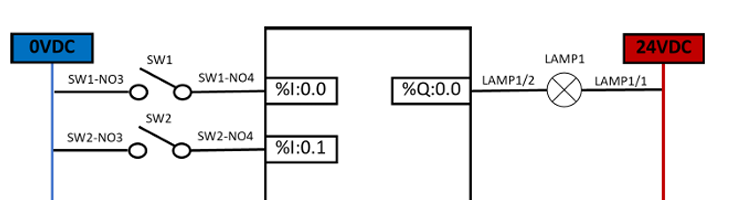

> **วงจรที่ได้** :rotating_light:

> **ผลลัพธ์ที่ได้** :sunflower:
> 
> 

## Counter 

>เงื่อนไขการทดลอง 
>1. กด SW3 Counter UP ครบ 5  ครั้ง  LAMP1 ทำงาน 
>2. กด SW1 เพื่อ RESET Counter นับ 0 LAMP1 หยุดทำงาน 
>3. กด SW2 เพื่อ SET Counter นับ 5 LAMP1 หยุดทำงาน 
>4. กด SW4 Counter  Countdown นับ 4,3,2,1 ตามลำดับ LAMP1 หยุดทำงาน 

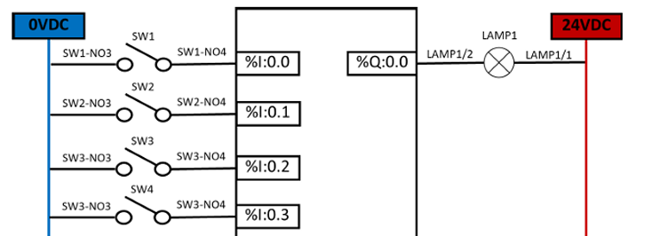

> **วงจรที่ได้** :rotating_light:

> **ผลลัพธ์ที่ได้** :sunflower:
> 
 

##  Traffic Light Control 

> **วงจรที่ได้** :rotating_light:
>input
 
>mode select
 
>mode
 
 

> **ผลลัพธ์ที่ได้** :sunflower:
>  
>  
> 