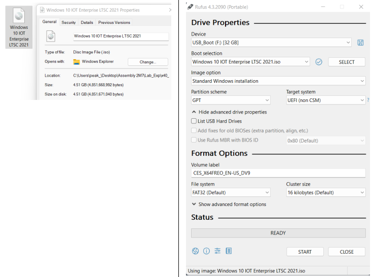
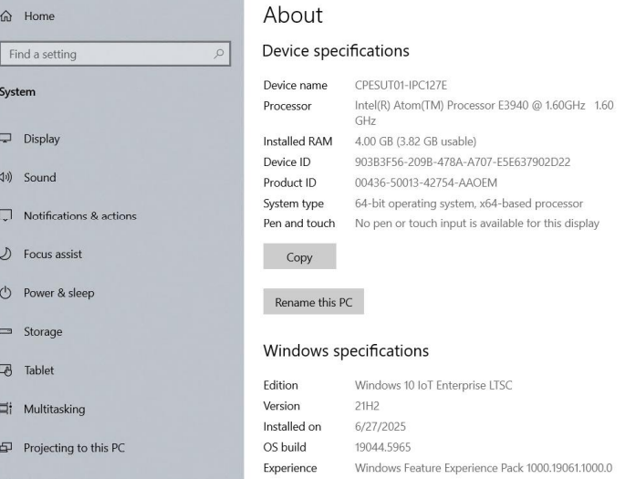
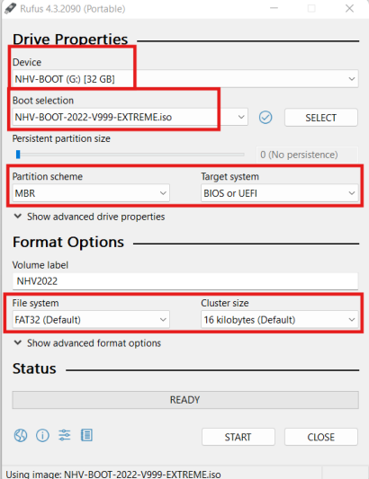
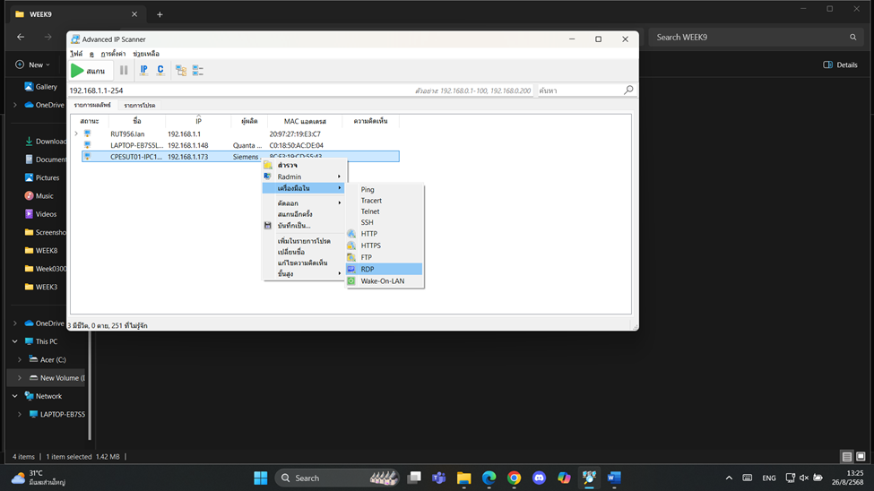
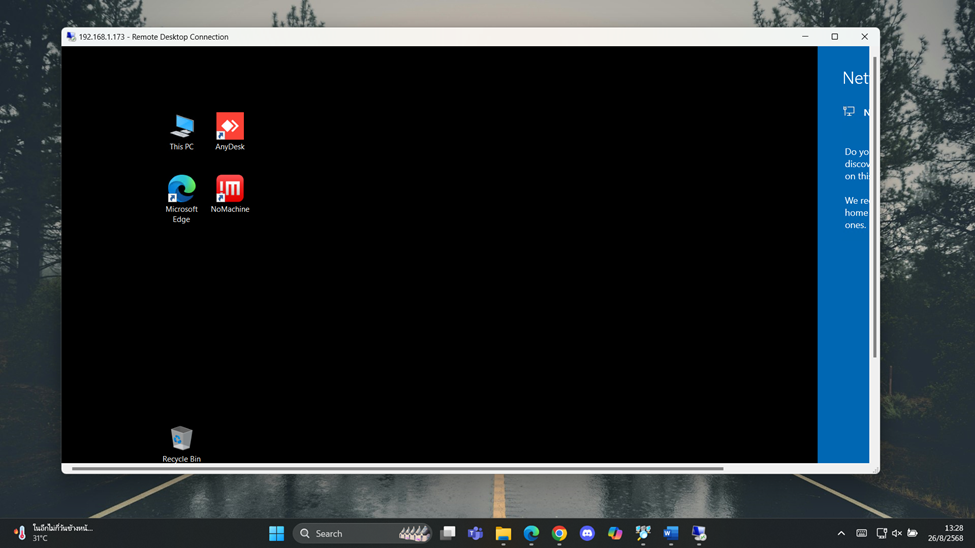
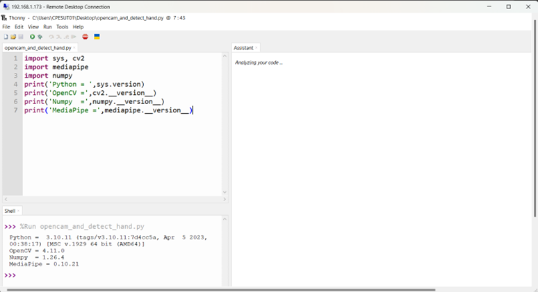
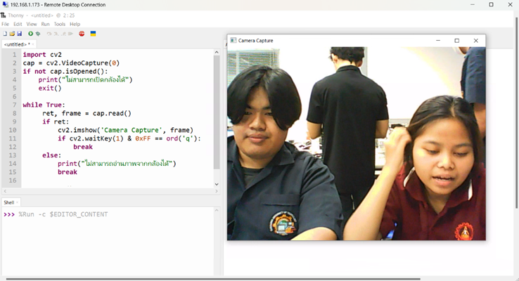

# **Siemens Simatic IPC127**
### **Install OS**
##### Install Win-10 IOT OS

>* Download “Windows 10 IOT Enterprise LTSC 2021.iso”
>* สร้าง USB Boot Drive ด้วยโปรแกรม “rufus-4.3p.exe”



>* IPC127 เข้า Boot Manu ด้วยการกด ESC Key
>* เลือก USB Boot และติดตั้ง Win10 IOT



##### Clone OS
>* เรียกโปรแกรม rufus-4.3p.exe
>* เขียนไฟล์ USBBOOT “NHV-BOOT-2022-V999-EXTREME.iso” ไปยัง USB Drive



>* BOOT SIEMENS IPC127 จาก USB_Drive <IPC127 เข้า BOOT Manu ด้วยการกด ESC Key>
>* เรียกใช้โปรแกรม Symantec Ghost
• กรณีเก็บ HDD : Ghost >> Disk to Image
• กรณีเขียน HDD : Ghost >> Image to Disk


##### เปิดใช้งาน Remote Desktop


> * ค้นหาใน Advenced IP Scanner
> * คลิกขวา > เลือก **เครื่องมือใน** > **RDP**



## Image Processing
##### **ติดตั้ง Thony Python และทดสอบการทำงาน**
##### Add Library
>*	Install OpenCV	    pip install opencv-python==4.11.0.86
>*	Install mediapipe	pip install mediapipe==0.10.21
>*  Install numpy       pip install numpy==1.26.4
>*	Install requests	pip install requests

######  ทดสอบ mediapipe

```cpp
import sys, cv2
import mediapipe
import numpy
print('Python = ',sys.version)
print('OpenCV =',cv2.__version__)
print('Numpy =',numpy.__version__)
print('MediaPipe =',mediapipe.__version__)
```



###### **Test Code_OpenCAM**
```cpp
import cv2
cap = cv2.VideoCapture(0)
if not cap.isOpened():
 print("ไม่สามารถเปิดกล้องได้")
 exit()
while True:
 ret, frame = cap.read()
 if ret:
 cv2.imshow('Camera Capture', frame)
 if cv2.waitKey(1) & 0xFF == ord('q'):
 break
 else:
 print("ไม่สามารถอ่านภาพจากกล้องได้")
 break
cap.release()
cv2.destroyAllWindows()
```


###### **Test Code_Hand detection**
```cpp
import cv2 
import mediapipe as mp 
 
# Initialize MediaPipe Hands 
mp_hands = mp.solutions.hands 
hands = mp_hands.Hands() 
mp_drawing = mp.solutions.drawing_utils 
 
# Function to detect the state of each finger 
def count_fingers(hand_landmarks): 
   # Detect finger states (up or down) 
   thumb_up = hand_landmarks.landmark[mp_hands.HandLandmark.THUMB_TIP].x < hand_landmarks.landmark[mp_hands.HandLandmark.THUMB_IP].x 
   index_up = hand_landmarks.landmark[mp_hands.HandLandmark.INDEX_FINGER_TIP].y < hand_landmarks.landmark[mp_hands.HandLandmark.INDEX_FINGER_PIP].y 
   middle_up = hand_landmarks.landmark[mp_hands.HandLandmark.MIDDLE_FINGER_TIP].y < hand_landmarks.landmark[mp_hands.HandLandmark.MIDDLE_FINGER_PIP].y 
   ring_up = hand_landmarks.landmark[mp_hands.HandLandmark.RING_FINGER_TIP].y < hand_landmarks.landmark[mp_hands.HandLandmark.RING_FINGER_PIP].y 
   pinky_up = hand_landmarks.landmark[mp_hands.HandLandmark.PINKY_TIP].y < hand_landmarks.landmark[mp_hands.HandLandmark.PINKY_PIP].y 
   # Combine finger statuses into a list 
   finger_status = [thumb_up, index_up, middle_up, ring_up, pinky_up] 
   return finger_status 
 
# Initialize VideoCapture 
cap = cv2.VideoCapture(1) 
while cap.isOpened(): 
   ret, frame = cap.read() 
   if not ret: 
       break 
   frame = cv2.flip(frame, 1) 
   frame_rgb = cv2.cvtColor(frame, cv2.COLOR_BGR2RGB) 
   # Detect hand landmarks 
   results = hands.process(frame_rgb) 
   if results.multi_hand_landmarks and results.multi_handedness:
    for idx, (hand_landmarks, handedness) in enumerate(zip(results.multi_hand_landmarks, results.multi_handedness)):

        # ตรวจสอบว่าเป็นมือซ้ายหรือมือขวา
        hand_label = handedness.classification[0].label  # "Left" หรือ "Right"

        # วาดจุดมือ
        mp_drawing.draw_landmarks(frame, hand_landmarks, mp_hands.HAND_CONNECTIONS)

        # นับนิ้ว: ได้ลิสต์เช่น [1, 1, 0, 0, 0]
        fingers = count_fingers(hand_landmarks)

        # แสดงผล
        text = f"{hand_label} Hand: {fingers}"
        position = (50, 50 + idx * 40)

        cv2.putText(frame, text, position, cv2.FONT_HERSHEY_SIMPLEX, 0.8, (0, 255, 0), 2)

   cv2.imshow('Hand Gesture Recognition', frame) 
   if cv2.waitKey(5) & 0xFF == 27:  # Exit on pressing 'Esc' 
       break 
cap.release() 
cv2.destroyAllWindows() 
```
###### **ผลลัพธ์**

[yotubeeeeeeeeeee](https://youtu.be/g7V_QVgYmQY)


###### **ทดสอบ mediapipe ส่งค่าไปแสดงที่ 10 LED**

###### Setup ESP32
>* อัปโหลดโค้ดลง ESP32 เพื่อเปิด WebServer

```cpp
#include <WiFi.h>
#include <ESPAsyncWebServer.h>

const char* ssid = "RUT956_E3C9";
const char* password = "12345678";

AsyncWebServer server(80);

// LED pins for right hand
const int rightThumbPin = 27; 
const int rightIndexPin = 26; 
const int rightMiddlePin = 25;
const int rightRingPin = 33; 
const int rightPinkyPin = 32;

// LED pins for left hand
const int leftThumbPin = 14;
const int leftIndexPin = 12;
const int leftMiddlePin = 13;
const int leftRingPin = 18;
const int leftPinkyPin = 19;

void setup() {
  Serial.begin(115200);

  // Setup all pins as OUTPUT and turn off initially
  int allPins[] = {rightThumbPin, rightIndexPin, rightMiddlePin, rightRingPin, rightPinkyPin,
                   leftThumbPin, leftIndexPin, leftMiddlePin, leftRingPin, leftPinkyPin};

  for (int i = 0; i < 10; i++) {
    pinMode(allPins[i], OUTPUT);
    digitalWrite(allPins[i], LOW);
  }

  Serial.println("Connecting to WiFi...");
  WiFi.begin(ssid, password);
  int attempts = 0;
  while (WiFi.status() != WL_CONNECTED && attempts < 20) {
    delay(1000);
    Serial.print(".");
    attempts++;
  }

  if (WiFi.status() == WL_CONNECTED) {
    Serial.println("\nConnected to WiFi");
    Serial.print("IP Address: ");
    Serial.println(WiFi.localIP());

    // Right hand endpoints
    server.on("/led/right_thumb/on", HTTP_GET, [](AsyncWebServerRequest *request){
      digitalWrite(rightThumbPin, HIGH);
      request->send(200, "text/plain", "Right Thumb ON");
    });
    server.on("/led/right_thumb/off", HTTP_GET, [](AsyncWebServerRequest *request){
      digitalWrite(rightThumbPin, LOW);
      request->send(200, "text/plain", "Right Thumb OFF");
    });

    server.on("/led/right_index/on", HTTP_GET, [](AsyncWebServerRequest *request){
      digitalWrite(rightIndexPin, HIGH);
      request->send(200, "text/plain", "Right Index ON");
    });
    server.on("/led/right_index/off", HTTP_GET, [](AsyncWebServerRequest *request){
      digitalWrite(rightIndexPin, LOW);
      request->send(200, "text/plain", "Right Index OFF");
    });

    server.on("/led/right_middle/on", HTTP_GET, [](AsyncWebServerRequest *request){
      digitalWrite(rightMiddlePin, HIGH);
      request->send(200, "text/plain", "Right Middle ON");
    });
    server.on("/led/right_middle/off", HTTP_GET, [](AsyncWebServerRequest *request){
      digitalWrite(rightMiddlePin, LOW);
      request->send(200, "text/plain", "Right Middle OFF");
    });

    server.on("/led/right_ring/on", HTTP_GET, [](AsyncWebServerRequest *request){
      digitalWrite(rightRingPin, HIGH);
      request->send(200, "text/plain", "Right Ring ON");
    });
    server.on("/led/right_ring/off", HTTP_GET, [](AsyncWebServerRequest *request){
      digitalWrite(rightRingPin, LOW);
      request->send(200, "text/plain", "Right Ring OFF");
    });

    server.on("/led/right_pinky/on", HTTP_GET, [](AsyncWebServerRequest *request){
      digitalWrite(rightPinkyPin, HIGH);
      request->send(200, "text/plain", "Right Pinky ON");
    });
    server.on("/led/right_pinky/off", HTTP_GET, [](AsyncWebServerRequest *request){
      digitalWrite(rightPinkyPin, LOW);
      request->send(200, "text/plain", "Right Pinky OFF");
    });

    // Left hand endpoints
    server.on("/led/left_thumb/on", HTTP_GET, [](AsyncWebServerRequest *request){
      digitalWrite(leftThumbPin, HIGH);
      request->send(200, "text/plain", "Left Thumb ON");
    });
    server.on("/led/left_thumb/off", HTTP_GET, [](AsyncWebServerRequest *request){
      digitalWrite(leftThumbPin, LOW);
      request->send(200, "text/plain", "Left Thumb OFF");
    });

    server.on("/led/left_index/on", HTTP_GET, [](AsyncWebServerRequest *request){
      digitalWrite(leftIndexPin, HIGH);
      request->send(200, "text/plain", "Left Index ON");
    });
    server.on("/led/left_index/off", HTTP_GET, [](AsyncWebServerRequest *request){
      digitalWrite(leftIndexPin, LOW);
      request->send(200, "text/plain", "Left Index OFF");
    });

    server.on("/led/left_middle/on", HTTP_GET, [](AsyncWebServerRequest *request){
      digitalWrite(leftMiddlePin, HIGH);
      request->send(200, "text/plain", "Left Middle ON");
    });
    server.on("/led/left_middle/off", HTTP_GET, [](AsyncWebServerRequest *request){
      digitalWrite(leftMiddlePin, LOW);
      request->send(200, "text/plain", "Left Middle OFF");
    });

    server.on("/led/left_ring/on", HTTP_GET, [](AsyncWebServerRequest *request){
      digitalWrite(leftRingPin, HIGH);
      request->send(200, "text/plain", "Left Ring ON");
    });
    server.on("/led/left_ring/off", HTTP_GET, [](AsyncWebServerRequest *request){
      digitalWrite(leftRingPin, LOW);
      request->send(200, "text/plain", "Left Ring OFF");
    });

    server.on("/led/left_pinky/on", HTTP_GET, [](AsyncWebServerRequest *request){
      digitalWrite(leftPinkyPin, HIGH);
      request->send(200, "text/plain", "Left Pinky ON");
    });
    server.on("/led/left_pinky/off", HTTP_GET, [](AsyncWebServerRequest *request){
      digitalWrite(leftPinkyPin, LOW);
      request->send(200, "text/plain", "Left Pinky OFF");
    });

    // Optional: shut off all for left or right hand
    server.on("/led/right_all/down", HTTP_GET, [](AsyncWebServerRequest *request){
      digitalWrite(rightThumbPin, LOW);
      digitalWrite(rightIndexPin, LOW);
      digitalWrite(rightMiddlePin, LOW);
      digitalWrite(rightRingPin, LOW);
      digitalWrite(rightPinkyPin, LOW);
      request->send(200, "text/plain", "Right Hand All OFF");
    });

    server.on("/led/left_all/down", HTTP_GET, [](AsyncWebServerRequest *request){
      digitalWrite(leftThumbPin, LOW);
      digitalWrite(leftIndexPin, LOW);
      digitalWrite(leftMiddlePin, LOW);
      digitalWrite(leftRingPin, LOW);
      digitalWrite(leftPinkyPin, LOW);
      request->send(200, "text/plain", "Left Hand All OFF");
    });

    server.begin();
    Serial.println("Server started");
  } else {
    Serial.println("\nFailed to connect to WiFi");
  }
}

void loop() {
  // Nothing here
}
```

###### ESP32 จะพร้อมรับ URL เช่น:

>* http://<ESP32_IP>/led?status=1100001110

###### เพื่อควบคุม LED 10 ดวง
```cpp
import cv2
import mediapipe as mp
import requests

# ESP32 Base URL
ESP32_IP = "http://192.xx.xxx.x."  # เปลี่ยนเป็น IP ของคุณ

# Initialize MediaPipe Hands
mp_hands = mp.solutions.hands
hands = mp_hands.Hands(static_image_mode=False, max_num_hands=2, min_detection_confidence=0.7)
mp_drawing = mp.solutions.drawing_utils

# ส่งคำสั่งไปยัง ESP32
def control_led(endpoint):
    url = f"{ESP32_IP}/led/{endpoint}"
    try:
        response = requests.get(url)
        print(f"Sent command: {endpoint}, ESP32 Response: {response.text}")
    except Exception as e:
        print(f"Failed to send command: {endpoint}, Error: {e}")

# ดึงคำสั่งจาก ESP32
def fetch_esp32_command():
    try:
        url = f"{ESP32_IP}/command"
        response = requests.get(url)
        return response.text.strip()
    except Exception as e:
        print(f"Error fetching command from ESP32: {e}")
        return None

# ตรวจจับนิ้วที่ชูอยู่
def count_fingers(hand_landmarks, hand_label):
    # กำหนด prefix ซ้ายหรือขวา
    prefix = 'left' if hand_label == 'Left' else 'right'

    # ตรวจสอบการชูนิ้ว
    thumb_up = hand_landmarks.landmark[mp_hands.HandLandmark.THUMB_TIP].x < hand_landmarks.landmark[mp_hands.HandLandmark.THUMB_IP].x if hand_label == 'Right' else \
               hand_landmarks.landmark[mp_hands.HandLandmark.THUMB_TIP].x > hand_landmarks.landmark[mp_hands.HandLandmark.THUMB_IP].x
    index_up = hand_landmarks.landmark[mp_hands.HandLandmark.INDEX_FINGER_TIP].y < hand_landmarks.landmark[mp_hands.HandLandmark.INDEX_FINGER_PIP].y
    middle_up = hand_landmarks.landmark[mp_hands.HandLandmark.MIDDLE_FINGER_TIP].y < hand_landmarks.landmark[mp_hands.HandLandmark.MIDDLE_FINGER_PIP].y
    ring_up = hand_landmarks.landmark[mp_hands.HandLandmark.RING_FINGER_TIP].y < hand_landmarks.landmark[mp_hands.HandLandmark.RING_FINGER_PIP].y
    pinky_up = hand_landmarks.landmark[mp_hands.HandLandmark.PINKY_TIP].y < hand_landmarks.landmark[mp_hands.HandLandmark.PINKY_PIP].y

    # ส่งคำสั่งตามนิ้วและมือ
    control_led(f"{prefix}_thumb/on" if thumb_up else f"{prefix}_thumb/off")
    control_led(f"{prefix}_index/on" if index_up else f"{prefix}_index/off")
    control_led(f"{prefix}_middle/on" if middle_up else f"{prefix}_middle/off")
    control_led(f"{prefix}_ring/on" if ring_up else f"{prefix}_ring/off")
    control_led(f"{prefix}_pinky/on" if pinky_up else f"{prefix}_pinky/off")

    finger_status = [thumb_up, index_up, middle_up, ring_up, pinky_up]

    # ถ้านิ้วทั้งหมดของมือนั้นปิด
    if not any(finger_status):
        print(f"All fingers are down on {prefix} hand")
        control_led(f"{prefix}_all/down")

    return finger_status

# เปิดกล้อง
cap = cv2.VideoCapture(0)

while cap.isOpened():
    ret, frame = cap.read()
    if not ret:
        break

    frame = cv2.flip(frame, 1)
    frame_rgb = cv2.cvtColor(frame, cv2.COLOR_BGR2RGB)
    results = hands.process(frame_rgb)

    if results.multi_hand_landmarks and results.multi_handedness:
        for hand_landmarks, handedness in zip(results.multi_hand_landmarks, results.multi_handedness):
            hand_label = handedness.classification[0].label  # 'Left' หรือ 'Right'
            mp_drawing.draw_landmarks(frame, hand_landmarks, mp_hands.HAND_CONNECTIONS)
            count_fingers(hand_landmarks, hand_label)

    # แสดงคำสั่งจาก ESP32
    esp32_command = fetch_esp32_command()
    if esp32_command:
        cv2.putText(frame, f"ESP32 Command: {esp32_command}", (10, 50), cv2.FONT_HERSHEY_SIMPLEX, 0.8, (0, 255, 0), 2)

    cv2.imshow('Hand Gesture Recognition', frame)

    if cv2.waitKey(5) & 0xFF == 27:
        break

cap.release()
cv2.destroyAllWindows()
```

##### **ผลลัพธ์**


#### **Embedded System based on Windows Device**
##### ปรับแต่งให้ โปรแกรมทำงานทันทีเมื่อเปิดเครื่อง IPC217
> * ใส่ shortcut ไว้ที่โฟลเดอร์ Startup

> * คัดลอกไปที่โฟลเดอร์ Startup เพื่อให้เปิดเมื่อผู้ใช้ล็อกอิน


##### **ผลลัพธ์**
